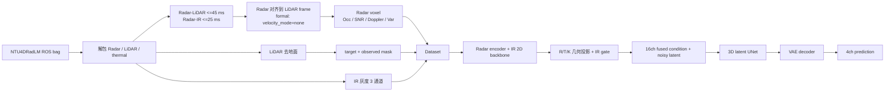

# 4D Radar Diffusion

面向机载 4D Radar 与热红外条件融合的单帧 3D Occupancy 生成研究代码。当前代码包含 NTU4DRadLM 数据预处理、VAE、latent diffusion、LDM 初始化的 EMA consistency、离线推理、评价和概率地图回放原型。

> 当前能力边界：代码已经实现 Radar–IR 特征级融合和不依赖 LiDAR 的 prediction forward，但尚未形成 ROS1/PX4 实时感知—规划—控制闭环。`streaming_map_update.py` 是文件序列回放工具，不是已部署的在线节点。

详细代码审计与逐文件证据见 [当前工程数据流与网络结构](./docs/current_architecture.md)。

## 当前状态先读

当前仓库同时存在三套名称相近、但不能混用的数据入口：

| 入口 | 实际输出/默认绑定 | 状态 |
|---|---|---|
| `NTU4DRadLM_pre_processing/preprocess.sh` | `formal_v2_80m_86p8_v1` | 旧服务器绑定脚本，硬编码 `/home/ps/...` 和 Conda 环境 `Radar` |
| `NTU4DRadLM_pre_processing/preprocess-v2.sh` | `formal_v2_1_80m_86p8_db_snr_v1`、formal-data-v4 | 可生成全新候选数据，但没有自动接入默认训练/部署路径 |
| `NTU4DRadLM_pre_processing/preprocess-v3.sh` | `formal_v3_80m_86p8_v1`、formal-data-v4 | 带 verified field schema/extraction receipt 的新链，也没有接入默认训练/部署路径 |
| `default_config.yaml` 与正式 train/inference launcher | `formal_v2_80m_86p8_v1` | 当前默认运行绑定 |

默认链还有一个必须先处理的阻断点：

- 默认 YAML 指向 `radar_normalization_garden_32x128x128_80m_train80_purge3s_86p8_v2.json`；
- 该文件内部实际是 `radar_normalization_v1`，variance aggregation 为旧的 `occupied_voxel_equal_weight_total_variance`；
- 当前 preprocessor 固定写 `radar_point_count_field_validity_v2`，Dataset 要求 `field_valid_count_weighted_total_variance_v2`；
- 两者一起使用时，Dataset 会在模型 forward 前抛出 `RadarNormalizationError`。

因此，不应把“无环境变量覆盖的默认预处理 → 默认训练 → 默认推理”描述为已贯通。开始正式训练前，必须让数据根、split、data protocol、normalization artifact、其 SHA-256 和 `PROTOCOL_TAG` 成套一致，并先执行 `PREFLIGHT_ONLY=1`。

正式 inference launcher 还有一个独立阻断：`inference_ldm.sh`、`inference_cd.sh` 和 `inference_uniified.sh` 都调用 `diffusion_consistency_radar/scripts/diagnose_checkpoint_chain.py`，但该文件当前不在仓库中。因此这三个脚本表达了正式部署合同，却会在 checkpoint-chain 预检阶段失败；恢复该正式脚本之前，不能称为当前 checkout 可一键运行的入口。

## 真实数据流



formal v2/v3 launcher 的空间范围均为 `[x:0..80, y:-20..20, z:-6..10] m`，原始 voxel 分辨率为 `0.2 m`；Dataset 最终输出 `(Z,X,Y)=(32,128,128)`。当前实现是单帧 Dataset，`sequence_length != 1` 会失败。

## 数据与张量合同

### Radar 输入

原始 Radar 固定布局为 `[x,y,z,Power,Doppler]`。在 verified schema 中，`Power` 是 dB SNR，`Doppler` 是 m/s、相对传感器径向速度、远离传感器为正。

网络接收 `(B,4,32,128,128)`：

| 通道 | 物理/统计语义 | 是否进入网络 |
|---:|---|---|
| 0 | Radar occupancy | 是 |
| 1 | 体素内有限 Power/SNR 均值 | 是 |
| 2 | 体素内有限 Doppler 均值 | 是 |
| 3 | `clip(E[v²]-E[v]²,0,50)` Doppler 方差 | 是，也用于物理置信度 |

`x/y/z` 决定体素空间位置和 occupancy，但不是额外输入通道。`point_count`、`intensity_valid_count`、`doppler_valid_count` 只控制 resize 聚合，不进入网络。

当前正式 launcher 使用 `velocity_mode=none`，所以不能把 ch2 描述为已做机体自运动补偿的 Doppler。

### IR 输入

thermal image 在预处理时转为灰度、resize 到 `640×480`、除以 255，并复制为三个相同通道。Dataset 返回 IR 和 LiDAR-frame→thermal 的 `R/T/K`。

IR 在网络中经过：

```text
IR (3×480×640)
  → ResNet-18 conv1..layer2（weights=None；torchvision 不可用时为 fallback CNN）
  → 1×1 Conv 得到 32ch
  → R/T/K 投影到 3D voxel + frustum mask
  → [Radar16, IR32, confidence1] 的 49ch IR gate
  → 49ch fusion Conv
  → 16ch 3D condition
```

IR 不是只用于可视化，也不是在 Dataset 中提前拼到 Radar voxel；实际融合发生在 `CompleteDualModalityPerceptionNet.forward()` 内、3D diffusion UNet 之前。

### LiDAR 监督

四通道 target 为：

| 通道 | 来源 | 语义 |
|---:|---|---|
| 0 | 去地面 LiDAR | occupancy |
| 1 | 去地面 LiDAR | reflectivity/return-strength 均值 |
| 2 | Radar | LiDAR target 位置附近的 Radar Doppler 均值 |
| 3 | Radar | Doppler-valid mask |

LiDAR 还通过 endpoint 到传感器原点的 free-space ray 生成 authoritative `observed_mask`。VAE 直接重建 target；LDM/CD 使用 VAE 编码后的 target latent 作为真值。LiDAR voxel 不传入多模态 model forward。

## 当前网络结构

### VAE

- 输入/输出 4ch，latent 4ch；默认 `ultra_lightweight`。
- `(4,32,128,128)` 经 encoder 得到 `(4,16,32,32)` latent。
- LDM/CD 使用 posterior mean 作为确定性 target latent。

### Radar–IR 融合

- Radar encoder：`Conv3d 4→16 → GN → SiLU → Conv3d 16→16 → GN → SiLU`。
- IR feature：32ch，经标定投影到 `(32,128,128)` voxel grid。
- confidence：主要来自 Radar ch3，`confidence=1/(1+variance/10)`。
- gate：49ch → `Conv3d 49→32 + Sigmoid`，逐通道门控 IR。
- fusion：49ch → `Conv3d 49→16 + ReLU`。
- fused condition 插值到 latent 空间后，4ch noisy latent 逐元素加到 fused 的前四通道，不是 concat。

### 3D latent UNet

- 输入 16ch、输出 4ch，base channel 32。
- channel level：32 → 64 → 96。
- 空间层级：`(16,32,32) → (8,16,16) → (4,8,8)`。
- 各分辨率 attention 关闭，但 middle block 仍有 linear attention。
- decoder 使用 skip concat 并恢复 4ch latent。

## 训练目标

### VAE

正式 VAE 只在 persisted observed domain（并强制保留 target positive）计算：

```text
L_VAE = BCEWithLogits(ch0)
      + soft Dice(ch0)
      + SmoothL1(ch1..3, continuous-valid voxels)
      + 1e-6 * KL
```

### LDM

LDM 以 `z_noisy=z_target+sigma*noise` 训练。主项是 observed latent 域内的普通 MSE，不是当前代码中未被调用的 EDM sigma-weighted training loss。默认非零辅助项为：

- decoded occupancy weighted-MSE：0.05；
- observed-free false positive：0.10；
- occupancy mass：0.05；
- height distribution：0.02；
- vertical continuity：0.02；
- heteroscedastic Gaussian NLL：0.05。

### EMA consistency（历史名 CD）

CD 用 LDM 初始化 online 与 EMA 模型，训练期没有持续调用冻结 LDM teacher：

```text
L_CD = 1.0 * MSE(student, stopgrad(EMA target))
     + 0.1 * MSE(student, target latent)
```

两项都受 observed latent mask 约束；第二项用于排除输入无关的常数解。

## 项目结构

```text
NTU4DRadLM_pre_processing/          # rosbag 解包、同步、体素与监督构建
diffusion_consistency_radar/
  cm/                               # Dataset、VAE、UNet、多模态融合
  config/                           # 数据、训练、schema 与 normalization 配置
  launch/                           # 正式 train/inference/evaluation 入口
  scripts/                          # 训练、推理、评价、地图与诊断实现
docs/current_architecture.md        # 当前架构代码审计
test/                               # unit、mini-test 与结果目录
Data/                               # 原始/预处理数据，默认不纳入 Git
Result/                             # 正式训练/推理产物，默认不纳入 Git
```

## 环境

项目环境名为 `Radar-Diffusion`：

```bash
conda activate Radar-Diffusion
pip install -e diffusion_consistency_radar
```

也可以避免激活环境，直接运行：

```bash
conda run -n Radar-Diffusion python <script.py>
```

## 数据准备

不要无参数直调 `NTU4DRadLM_pre_processing.py`。正式数据链需要 launcher 提供同步阈值、全部标定、空间范围、监督 policy、schema 和 receipt 参数。

新的 verified 数据候选可在全新输出目录运行：

```bash
# formal-v2.1 候选；全量解包/预处理，耗时且占用大量磁盘
bash NTU4DRadLM_pre_processing/preprocess-v2.sh

# 或 formal-v3 候选；同样是长任务
bash NTU4DRadLM_pre_processing/preprocess-v3.sh
```

两个脚本都拒绝覆盖已有 Raw、training、deployment 和 normalization 输出。它们的输出 tag 与默认训练 tag 不同，运行后仍需成套设置训练/推理 override。

## 训练

正式训练入口是 [train_unified.sh](./diffusion_consistency_radar/launch/train_unified.sh)。在修正数据/artifact 绑定后，先只读预检：

```bash
PREFLIGHT_ONLY=1 \
conda run --no-capture-output -n Radar-Diffusion bash \
  diffusion_consistency_radar/launch/train_unified.sh vae
```

预检通过后才按依赖顺序运行：

```bash
conda run --no-capture-output -n Radar-Diffusion bash \
  diffusion_consistency_radar/launch/train_unified.sh vae

conda run --no-capture-output -n Radar-Diffusion bash \
  diffusion_consistency_radar/launch/train_unified.sh ldm

conda run --no-capture-output -n Radar-Diffusion bash \
  diffusion_consistency_radar/launch/train_unified.sh cd
```

`all` 会按 VAE → LDM → CD 串行执行。已有结果默认拒绝覆盖；只有确认 checkpoint 与同一数据协议完全一致后才可设置 `ALLOW_RESUME=1`。

若使用 v2.1/v3 新数据，至少需要成套覆盖以下变量，不能只改数据路径：

```text
PROTOCOL_TAG
PREPROCESSED_ROOT
RADAR_NORMALIZATION_ARTIFACT
EXPECTED_ARTIFACT_SHA256
TEMPORAL_SPLIT_ARTIFACT
DATA_PROTOCOL_ARTIFACT
```

默认训练配置见 [default_config.yaml](./diffusion_consistency_radar/config/default_config.yaml)，场景划分见 [data_loading_config.yml](./diffusion_consistency_radar/config/data_loading_config.yml)。当前 YAML 默认使用两张卡 `CUDA_DEVICES=0,1`，可在单次运行中显式覆盖 1–4 个不重复 GPU 编号。

## 正式推理

正式 prediction 需要 Radar、IR、真实标定、VAE/model checkpoint、checkpoint 内嵌 normalization 和 validation threshold artifact；**不需要 LiDAR 或 target**。

设计上的独立正式入口是：

```bash
bash diffusion_consistency_radar/launch/inference_ldm.sh
bash diffusion_consistency_radar/launch/inference_cd.sh
```

当前 checkout 缺少上述 launcher 调用的 `scripts/diagnose_checkpoint_chain.py`，所以命令会在生成前失败。此处保留它们是为了准确说明正式合同，不表示本次已验证可运行。

- LDM：40-step Heun。
- CD：1-step Euler，并应用训练一致的 boundary parameterization。

一次运行 LDM、CD 1-step 和当前实验性 CD 4-step 的入口是：

```bash
bash diffusion_consistency_radar/launch/inference_uniified.sh
```

文件名中的 `uniified` 是仓库当前保留的实际拼写。CD 4-step 会走 `_ldm_sample()` 的 Euler 路径，不会在每一步应用 CD boundary，不能等同于四次标准 CD 一步采样，也没有代码证据保证它比 1-step 质量更高。

完整参数、产物和故障门禁见 [推理使用指南](./INFERENCE_GUIDE.md)。

## 输出与离线评价

正式 prediction voxel 为 `(4,Z,X,Y)`：

| 通道 | prediction 语义 |
|---:|---|
| 0 | occupancy probability；正式 sigmoid 协议只对该通道概率化 |
| 1 | LiDAR return-strength 的生成重建值 |
| 2 | Radar-neighborhood Doppler 的生成重建值 |
| 3 | Doppler-valid target 的生成重建值 |

不确定性不是 ch3，而是单独的 `*_uncertainty.npy`。点云 `*_pcl.npy` 为 `(N,4)`，列是 `x,y,z,prediction_ch1`。

生成和评价严格解耦。默认 formal-v2 保存完成后执行：

```bash
bash diffusion_consistency_radar/launch/evaluate_inference.sh ldm
bash diffusion_consistency_radar/launch/evaluate_inference.sh cd
bash diffusion_consistency_radar/launch/evaluate_inference.sh cd4
```

该 launcher 当前固定 formal-v2 路径；v2.1/v3 结果必须显式调用 `evaluate_saved_predictions.py` 并提供完全匹配的 prediction、Radar、target、run metadata 和可选 raw LiDAR 路径。

## Mini Test 与诊断

短测试与实验入口位于 `test/`，不要把 mini checkpoint 接入正式部署链：

- [test/README.md](./test/README.md)
- [test/mini-test/README.md](./test/mini-test/README.md)

legacy/diagnostic 入口包括 `launch/compare.sh`、`launch/diagnose.sh` 和 `scripts/evaluate.py`。它们不等同于带 manifest、checkpoint-chain、observed-domain 和 threshold receipt 的正式评价。

## 已知限制

- 当前为单帧 Radar–IR 条件生成，不是时序传感器融合网络。
- formal 默认不做 Radar egomotion/Doppler 补偿。
- default formal-v2 normalization 与当前 statistics-v2 输入合同冲突，需先修正 artifact 绑定。
- 三个正式 inference launcher 引用的 `scripts/diagnose_checkpoint_chain.py` 当前缺失，恢复前无法一键执行。
- formal-v2.1/v3 数据链尚未成为 train/deploy launcher 默认值。
- 无条件聚合样本模式对多模态 checkpoint 使用零 Radar 与 mock IR/标定，只能用于诊断。
- 训练完成、checkpoint 可加载、GPU 精度/吞吐和服务器 artifact 存在性必须在目标机器上验证。
- 概率地图模块仍是离线回放原型；ROS1/PX4 action/service 闭环尚未由当前调用链证明。
